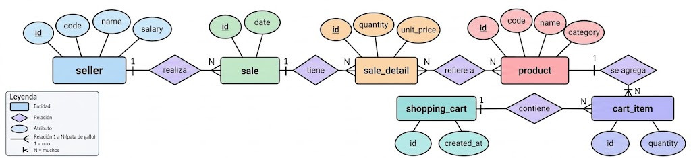
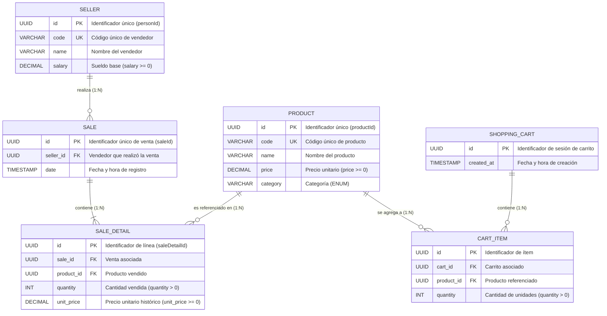

# Modelo de Datos

## Diagrama Entidad-Relación

El siguiente diagrama representa el modelo de datos utilizado para gestionar
productos, vendedores y ventas.





---

## Modelos

El modelo de dominio relacional está compuesto por las siguientes entidades:

- `product`: representa los productos disponibles para la venta.
- `seller`: representa a los vendedores que realizan las ventas.
- `sale`: representa una operación de venta confirmada.
- `sale_detail`: representa el detalle de los productos incluidos en una venta.
- `shopping_cart`: representa la sesión de compra previa a la confirmación de la venta.
- `cart_item`: representa cada producto y cantidad acumulada dentro de un carrito.

### Product

La entidad `product` almacena la información correspondiente a cada producto
que puede ser comercializado.

Un producto puede participar en múltiples ventas, ya que el mismo producto
puede ser vendido en diferentes operaciones.

### Seller

La entidad `seller` representa al vendedor responsable de realizar una venta.

Un vendedor puede realizar múltiples ventas a lo largo del tiempo, mientras
que cada venta pertenece a un único vendedor.

### Sale

La entidad `sale` representa una operación de venta.

Cada venta pertenece a un único vendedor y puede contener uno o más productos.
La información propia de la venta se mantiene separada de la información
específica de cada producto vendido.

### Sale Detail

La entidad `sale_detail` representa los productos que forman parte de una
venta.

Esta entidad funciona como entidad intermedia entre `sale` y `product`.

Además de resolver la relación entre ambas entidades, permite almacenar
información propia de la participación del producto dentro de una venta,
como por ejemplo cantidad, precio al momento de la venta o subtotal.

---

## Relaciones

### Seller → Sale

La relación entre `seller` y `sale` es **1:N**.

Un vendedor puede realizar muchas ventas, pero cada venta es realizada por
un único vendedor.

```text
Seller 1 ─────────── N Sale
```

### Sale → Sale Detail

La relación entre `sale` y `sale_detail` es **1:N**.

Una venta contiene una o más líneas de detalle, y cada detalle pertenece a una única venta.

```text
Sale 1 ─────────── N Sale Detail
```

### Product → Sale Detail

La relación entre `product` y `sale_detail` es **1:N**.

Un producto puede aparecer en múltiples detalles de diferentes ventas.

```text
Product 1 ─────────── N Sale Detail
```

### Shopping Cart → Cart Item

La relación entre `shopping_cart` y `cart_item` es **1:N**.

Un carrito de compras contiene uno o más ítems seleccionados.

```text
ShoppingCart 1 ─────────── N CartItem
```

### Product → Cart Item

La relación entre `product` y `cart_item` es **1:N**.

Un producto puede ser agregado a múltiples carritos de compras.

```text
Product 1 ─────────── N CartItem
```

---

## Esquema SQL DDL

El esquema relacional correspondiente se encuentra definido en [`/documents/schema.sql`](../src/main/resources/schema.sql).